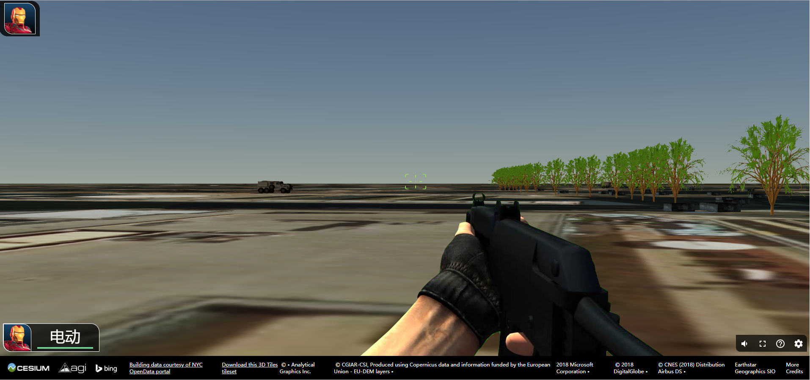

# GeoStrike (alpha)



 3D game for real world data. Boom!
 
 Play it live at [geo-strike.com](http://geo-strike.com/)
 
 ### Technologies
 Node, GraphQL, Angular, CesiumJS, [Angular Cesium](https://github.com/TGFTech/angular-cesium) 
 
 ## Getting started
 * Go to project directory
 * install
 ```bash
  yarn
 ```
 * run server & client:
 ```bash
  yarn start
 ```
 * enjoy: http://localhost:4200
 
 ## Enable remote users
 * Go to `packages/client/src/environments/environment.ts` and change server url to your ip with port 3000
 ```typescript
    serverUrl: 'localhost:3000' // OLD
    serverUrl: '[your_ip]:3000' // NEW
 ```
 * run normally
 ```bash
 yarn start
 ```

 * Now you and other players on the same lan can connect to http://[your_ip]:4200
 
 ## Game Controls
 * `Tab` - switch FPV/SemiFPV
 * `Shift` - run
 * `Space` - switch to shooting mode
 * `c` - crawling mode
 * `w,a,s,d` - move
 * `mouse_move` - look around
 * `mouse_click` - shoot (in shooting mode only)
 * `e` - enter nearby building
 
## Start a game
 * login to client http://[ip]:4200
 * choose new game
 * select character and user name
 * User code is shown (for other player to join your game they should choose "Join game" option and insert your game code)
 * Press "start game" and press "ready" when you want to start the game

## Start game on terrain
- Go to `packages/client/src/environments/environment.ts` and change the flag `loadTerrain` to true.
- Then run the command `TERRAIN=true yarn start`

## Required global packages for development
 install using `yarn global add <PACKAGE_NAME>` or `npm i  -g <PACKAGE_NAME>` 
 - server tools for running  local server:
    - [ts-node](https://github.com/TypeStrong/ts-node)
    - [nodemon](https://github.com/remy/nodemon)
 - client tools for running  angular/cli dev server:
    - [@angular/cli](https://github.com/angular/angular-cli)
 - generate code for GraphQL: [graphql-code-generator](https://github.com/dotansimha/graphql-code-generator)

## Credits list - how to modify
  to modify credits, open assets/credits/credits.json and add\delete\change destinated credit
